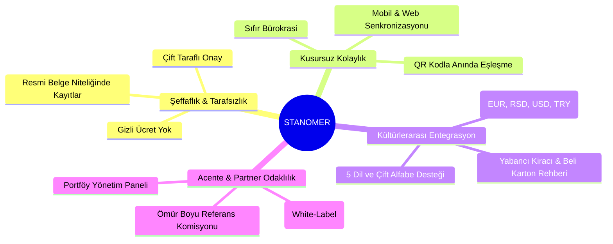

# 🏛️ STANOMER — MARKA KİMLİĞİ VE REHBERİ (BRAND IDENTITY & STYLE GUIDE)

> **Versiyon:** 2.0  
> **Son Güncelleme:** Ağustos 2026  
> **Sektör:** PropTech / Mülk Yönetimi ve Dijital Kira Ekosistemi  
> **Odak Bölge:** Sırbistan (Belgrad, Novi Sad) ve Uluslararası Balkanlar / Türkiye / Rusya / Avrupa  

---

## 1. MARKA HİKAYESİ VE İSİM KÖKENİ

### 1.1 İsim Analizi (Etymology)
* **STAN (Српски / Slav dilleri):** *Daire, ev, konut, yaşam alanı.*
* **MER (Ölçüm, Standart, Metrik, Şeffaflık):** *Düzen, güvenilir ölçüt, şeffaf kayıt ve yönetim standardı.*
* **STANOMER:** *"Yaşam alanının güvenilir ölçütü ve dijital yönetim standardı."*

Stanomer; ev sahipleri, kiracılar ve emlak acenteleri arasındaki geleneksel iletişim kopukluklarını, ödeme belirsizliklerini ve bürokratik engelleri ortadan kaldıran, **tarafsız ve şeffaf dijital bir köprüdür.**

---

### 1.2 Marka Sloganları (Taglines)

| Dil | Ana Slogan | Alt Slogan / Değer Önermesi |
| :--- | :--- | :--- |
| 🇹🇷 **Türkçe** | *Mülk Yönetiminde Yeni Nesil Şeffaflık* | Ev sahipleri ve kiracılar için dijital köprü. Kontrat, ödeme ve arıza takibi tek uygulamada. |
| 🇬🇧 **İngilizce** | *Next-Gen Transparency in Property Management* | The digital bridge for landlords and tenants. Manage leases, rent payments, and maintenance seamlessly. |
| 🇷🇸 **Sırpça (Latin)** | *Nova generacija transparentnosti u upravljanju nekretninama* | Digitalni most između stanodavaca i zakupaca. Ugovori, računi i prijave kvarova na jednom mestu. |
| 🇷🇸 **Sırpça (Ćirilica)** | *Нова генерација транспарентности у управљању некретнинама* | Дигитални мост између станодаваца и закупаца. Уговори, рачуни и пријаве кварова на једном месту. |
| 🇷🇺 **Rusça** | *Новый уровень прозрачности в управлении недвижимостью* | Цифровой мост между владельцами и арендаторами. Договоры, платежи и заявки на ремонт в одном приложении. |

---

## 2. MARKA MİSYONU, VİZYONU VE TEMEL DEĞERLER



### 2.1 Temel Değerler (Core Values)
1. **Mutlak Şeffaflık (Radical Transparency):** Kiracı ne görüyorsa ev sahibi de aynısını görür. Hesap dökümleri, gider makbuzları ve arıza mesajları değiştirilemez zaman damgasıyla saklanır.
2. **Kültürlerarası Güven Köprüsü (Cross-Border Harmony):** Farklı ülkelerden gelen kiracılar ile yerel ev sahipleri arasındaki dil ve mevzuat bariyerini 5 dilde çift taraflı çeviri ve yerel rehberlerle çözer.
3. **Zahmetsiz Sadelik (Frictionless Simplicity):** Kullanıcıyı boğmayan, 3 tıkta kira bildirimi yapılabilen, karmaşık tablolardan arındırılmış modern arayüz.

---

## 3. ÜÇLÜ EKOSİSTEM & KULLANICI ROLLERİ

Stanomer, benzersiz **Airbnb modeli role-switching** mantığıyla tek bir hesap altında 3 farklı role hizmet eder:

```
                  ┌─────────────────────────────────────┐
                  │              STANOMER               │
                  │        (Ortak Güven Platformu)      │
                  └──────────────────┬──────────────────┘
                                     │
           ┌─────────────────────────┼─────────────────────────┐
           ▼                         ▼                         ▼
  ┌─────────────────┐       ┌─────────────────┐       ┌─────────────────┐
  │   EV SAHİBİ     │       │    KİRACI       │       │    ACENTE       │
  │   (Landlord)    │       │    (Tenant)     │       │   (Agency)      │
  ├─────────────────┤       ├─────────────────┤       ├─────────────────┤
  │ • Zaman tasarrufu│      │ • Şeffaf fatura │       │ • Portföy takibi│
  │ • Düzenli ödeme │       │ • Arıza kaydı   │       │ • Özel QR kod   │
  │ • Dijital arşiv │       │ • Güvenli kira  │       │ • Pasif gelir   │
  └─────────────────┘       └─────────────────┘       └─────────────────┘
```

---

## 4. GÖRSEL KİMLİK & RENK PALETİ

Stanomer renk sistemi; güven hissi veren derin safir mavisi, onay ve düzeni simgeleyen zümrüt yeşili ve acentelere özel prestijli kraliyet morundan oluşur.

### 4.1 Ana Marka Renkleri (Primary Palette)

| Renk İsmi | Hex Kodu | RGB | Kullanım Alanı | Önizleme |
| :--- | :--- | :--- | :--- | :---: |
| **Stanomer Blue (Safir)** | `#1A5EB8` | `rgb(26, 94, 184)` | Ana butonlar, birincil eylemler, marka logosu |  |
| **Deep Navy (Gece Mavisi)** | `#0F172A` | `rgb(15, 23, 42)` | Ana başlıklar, karanlık zeminler, kontrast metinler |  |
| **Pressed Blue** | `#0E3D80` | `rgb(14, 61, 128)` | Buton hover/aktif durumları |  |
| **Surface Ice Blue** | `#E6EEF9` | `rgb(230, 238, 249)` | Seçili kart zeminleri, etiket arkaplanları |  |

### 4.2 Rol Tabanlı Renk Sistemi (Role Identities)

| Rol | Hex Kodu | Renk Anlamı & Amaç |
| :--- | :--- | :--- |
| 🏠 **Ev Sahibi (Landlord)** | `#1A5EB8` | Güven, istikrar, resmiyet ve mülkiyet koruması |
| 🔑 **Kiracı (Tenant)** | `#2DB87A` | Huzur, onay, zamanında ödeme ve arıza çözümü |
| 🏢 **Acente / Partner** | `#4A3AFF` / `#6D28D9` | Prestij, teknoloji, büyüme ve ayrıcalıklı ortaklık |
| ✨ **Acente Özel Gold** | `#C6A665` | Lüks portföyler, Axia Exclusive gibi elit acente rozetleri |

### 4.3 Fonksiyonel ve Durum Renkleri (Semantic)

| Durum | Hex Kodu | Açıklama |
| :--- | :--- | :--- |
| **Ödendi / Başarılı (Success)** | `#2DB87A` | Ödenen kiralar, onaylanan sözleşmeler, çözülen arızalar |
| **Beklemede (Pending/Warning)** | `#B06C10` | Ödeme günü yaklaşan faturalar, teklif aşamasındaki sözleşmeler |
| **Gecikmiş / İptal (Alert/Danger)** | `#C8503A` | Geciken ödemeler, acil arıza talepleri, sonlanan kontratlar |
| **Sayfa Zemini (Background)** | `#F8F7F5` | Gözü yormayan yumuşak sıcak kağıt dokusu tonu |
| **Kart Zemini (Card Surface)** | `#FFFFFF` | Net beyaz gölgeli kart panelleri |

---

## 5. TİPOGRAFİ SİSTEMİ (TYPOGRAPHY)

Tipografi hiyerarşisi, hem Latin hem Kiril alfabelerindeki özel karakterleri (`č, ć, đ, š, ž, Љ, Њ, Џ, љ, њ, џ`) kusursuz destekleyecek şekilde seçilmiştir.

### 5.1 Font Aileleri
* **Birincil Font (UI & Web):** `Inter`, `-apple-system`, `BlinkMacSystemFont`, `Segoe UI`, `sans-serif`
* **Vurgu & Başlık Fontu:** `Outfit`, `Poppins`, `sans-serif`
* **Monospace / Kod & Token:** `SF Mono`, `Fira Code`, `JetBrains Mono`, `monospace`

### 5.2 Tipografi Ölçeği

```
Display Hero:   36px - 48px / Bold (700-800)  -> Landing Page Hero & Sloganlar
H1 (Başlık):    28px - 32px / Bold (700)      -> Sayfa Başlıkları, Panel Karşılamaları
H2 (Alt Başlık):20px - 24px / SemiBold (600)  -> Modül Başlıkları, Kart Grupları
H3 (Kart İçi):  16px - 18px / Medium (500)    -> Mülk Başlıkları, Kiracı İsimleri
Body (Metin):   14px - 15px / Regular (400)   -> Açıklamalar, Sözleşme Maddeleri
Caption/Badge:  11px - 12px / SemiBold (600)  -> Sayaçlar, Durum Rozetleri, Tarihler
```

---

## 6. ARAYÜZ (UI) BİLEŞEN VE DİZAYN KURALLARI

### 6.1 Köşe Yuvarlama (Border Radius)
* `Radius XS (4px)`: Form etiketleri, mini rozetler.
* `Radius MD (8px)`: Butonlar, input alanları, açılır menü öğeleri.
* `Radius XL (16px)`: Kartlar, modallar, arıza talep pencereleri.
* `Radius Full (9999px)`: Durum sayaçları, profil avatarları, dil bayrak hapları.

### 6.2 Gölgelendirme (Elevation & Shadows)
```css
/* Hafif Kart Gölgeleri (Standard Card) */
box-shadow: 0 1px 3px 0 rgba(0, 0, 0, 0.05), 0 1px 2px 0 rgba(0, 0, 0, 0.03);

/* Vurgulu & Açılır Menü Gölgeleri (Dropdown & Sheet) */
box-shadow: 0 10px 15px -3px rgba(0, 0, 0, 0.08), 0 4px 6px -2px rgba(0, 0, 0, 0.04);

/* Glassmorphism Efekti (Header / Floating Bars) */
background: rgba(255, 255, 255, 0.85);
backdrop-filter: blur(12px);
border: 1px solid rgba(226, 232, 240, 0.8);
```

---

## 7. İLETİŞİM DİLİ VE TONU (TONE OF VOICE)

| Durum | Tercih Edilen Dil (DO) | Kaçınılması Gereken Dil (DON'T) |
| :--- | :--- | :--- |
| **Ödeme Bildirimleri** | *"Ağustos ayı kira ödemeniz kaydedildi ve ev sahibinize iletildi."* | *"Kira borcunuz ödendi."* (Soğuk ve borç odaklı dil) |
| **Arıza Talepleri** | *"Arıza talebiniz ev sahibine bildirildi. Süreci buradan anlık mesajlaşarak takip edebilirsiniz."* | *"Şikayetiniz oluşturuldu."* (Pasif ve bürokratik) |
| **Acente İletişimi** | *"Acente portföyünüzdeki 3 sözleşmenin bitimine 60 günden az kaldı. Yenileme teklifi hazırlayabilirsiniz."* | *"Kontratlar süresi doldu."* (Yönlendirmeyen eksik mesaj) |

### Temel İletişim İlkeleri:
1. **Çözüm Odaklı ve Net:** Kullanıcıya sadece problemi değil, atması gereken bir sonraki adımı gösterin.
2. **Kibar ve Güven Verici:** Tarafların birbirine güvenle yaklaşmasını teşvik eden dostane bir dil kullanın.
3. **Kısa ve Eyleme Yönelik:** Uzun hukuk terimleri yerine herkesin anlayabileceği açık maddeler kullanın.

---

## 8. MARKA UYGULAMA VE CO-BRANDING KURALLARI

### 8.1 Logo Koruma Alanı (Clear Space)
Logo çevresinde logonun 'S' harfi yüksekliği kadar hiçbir metin, grafik veya çerçeve yer alamaz.

### 8.2 Acente Co-Branding (Beyaz Etiketleme)
Stanomer'i kullanan emlak acentelerinin marka logoları ve kurumsal renkleri mobil ve web uygulamalarında desteklenir:
* **Üst Bar:** Acente Logosu (`max-height: 36px`)
* **Alt Rozet:** *"Powered by Stanomer"* (Şeffaflık ve altyapı güvencesi)
* **Özel Renk:** Acentenin birincil rengi buton ve kart çerçevelerine dinamik olarak yansıtılır.

---

*Stanomer Dijital Mülk Yönetim Ekosistemi © 2026. Tüm hakları saklıdır.*
